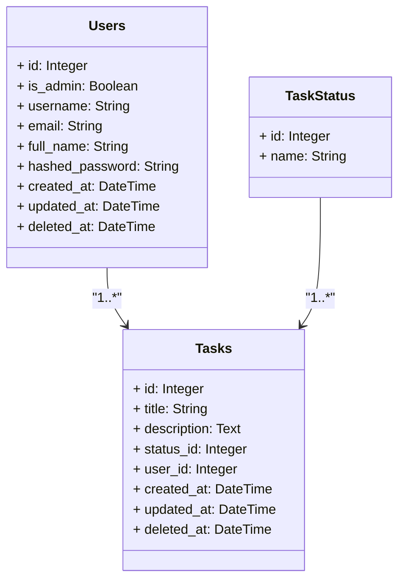

# ProjetoFIAP
Serviço de board de tarefas

### Resumo
Este projeto tem como objetivo a construção de uma ferramenta de administração de tarefas.
### Conteúdo
<!--ts-->
   * [Funcionalidades](###Funcionalidades)
   * [Instalação](###Instalação)
   * [Tecnologias](###Tecnologias)
<!--te-->

****

### Funcionalidades

#### Usuários

- [x] Login do usuário;
- [x] Criação de um novo usuário;
- [x] Leitura dos dados de todos os usuários válidos;
- [x] Leitura dos dados de um usuário;
- [x] Deleção de um usuário;
- [x] Atualização de um usuário.

#### Usuários Async
- [x] Leitura dos dados de todos os usuários válidos de forma assíncrona;
- [x] Leitura dos dados de um usuário de forma assíncrona;

#### Status de tarefas

- [x] Leitura de todos os status de tarefa disponíveis.

#### Tarefas

- [x] Criação de uma nova tarefa;
- [x] Leitura dos dados de todas as tarefas;
- [x] Leitura dos dados de todas as tarefas de um usuário;
- [x] Leitura dos dados de uma tarefa;
- [x] Deleção de uma tarefa;
- [x] Atualização de um usuário.

****

### Instalação
Antes de começar, será necessário instalar as seguintes ferramentas: [Git](https://git-scm.com) e [Docker](https://www.docker.com/).

Adicionalmente, é recomendada a utilização de uma das seguintes ferramentas: [VSCode](https://code.visualstudio.com/) ou [PyCharm](https://www.jetbrains.com/pt-br/pycharm/).

#### Clonando o repositório

```bash
# Acessar o diretório no seu terminal/cmd para onde o projeto será clonado
cd {diretório}
```

```bash
# Clonar o repositório
git clone https://github.com/JoaoClaudioLima/ProjetoFIAP.git
```
#### Rodando o projeto
```bash
# Acessar a pasta do repositório
cd ProjetoFIAP
```
```bash
# No terminal, executar
docker-compose up -d --build
```

Uma vez que o container tenha sido criado, realizar um ping no servidor para se certificar que não houve nenhum erro na sua inicialização.

```http request
http://localhost:8123/api/v1/health-check
```
Response:
```code
{
  "version": "0.0.1",
  "message": "Alive and kicking!"
}
```
Caso positivo, o serviço do back-end está pronto para ser utilizado! Segue documentação sobre as funcionalidades:

- Descritivo de funcionamento do serviço (Swagger): http://localhost:8123/docs#/
- Descritivo de funcionamento do serviço (Redoc): http://localhost:8123/api/v1/partner-redoc
- Descritivo de funcionamento do serviço (OpenAPI): http://localhost:8123/api/v1/openapi.json
- Visualização da database (pgAdmin): http://localhost:5050/login?next=/browser/
  - Login no pgAdmin:
    - user: **admin@example.com**
    - password: **admin**
  - Conectar na database:
    - Host name/address: **postgres**
    - Port: **5432**
    - Username: **user**
    - Password: **password**
- Vizualização de tarefas do serviço assíncrono (Flower + RabbitMQ): http://localhost:5555/tasks

Para validar que a database foi criada corretamente, utilizar o QueryTool do pgAdmin:

```bash
SELECT * FROM public.users;
```

Diagrama de classes da database:

Na inicializaçao do projeto foram criados alguns dados para validação e testes. Segue descritivo de tabelas e o diagrama:

- Task: Representa uma tarefa no sistema. Contém informações como título, descrição, status, usuário associado e timestamps de criação, atualização e exclusão. Relaciona-se com TaskStatus e User.

- TaskStatus: Representa o status de uma tarefa. Contém um nome único para o status e um relacionamento com as tarefas que possuem esse status.

- User: Representa um usuário no sistema. Contém informações como nome de usuário, email, nome completo, senha criptografada, se é administrador, e timestamps de criação, atualização e exclusão. Também possui um relacionamento com as tarefas associadas ao usuário.



****

### Tecnologias
As tecnologias a seguir foram escolhidas para garantir um desenvolvimento ágil, eficiente e escalável, proporcionando uma base sólida para a construção e manutenção do projeto.

- [x] **Python**: Linguagem de programação versátil e amplamente utilizada, ideal para desenvolvimento rápido e eficiente de aplicações web.
- [x] **FastAPI**: Framework web moderno e de alto desempenho para construir APIs com Python. Escolhido por sua facilidade de uso, rapidez e suporte a validação automática de dados.
- [x] **PostgreSQL**: Sistema de gerenciamento de banco de dados relacional robusto e escalável, conhecido por sua confiabilidade e suporte a diversas funcionalidades avançadas.
- [x] **pgAdmin**: Ferramenta de administração e desenvolvimento para PostgreSQL, que oferece uma interface gráfica amigável para gerenciar e visualizar bancos de dados.
- [x] **SQLAlchemy**: Biblioteca de ORM (Object-Relational Mapping) para Python, que facilita a interação com bancos de dados relacionais de forma mais intuitiva e eficiente.
- [x] **Alembic**: Ferramenta de migração de banco de dados para SQLAlchemy, que permite gerenciar mudanças no esquema do banco de dados de forma organizada e controlada.
- [x] **Docker**: Plataforma de containers que facilita a criação, implantação e execução de aplicações em ambientes isolados, garantindo consistência e portabilidade entre diferentes ambientes de desenvolvimento e produção.
- [x] **RabbitMQ**: Sistema de mensageria robusto que permite comunicação assíncrona entre diferentes componentes da aplicação, garantindo alta performance e confiabilidade no processamento de mensagens.
- [x] **Celery**: Biblioteca para execução de tarefas assíncronas e agendamento de jobs, utilizada para lidar com operações de longa duração ou de alta carga de processamento de forma eficiente.
- [x] **Flower**: Ferramenta de monitoramento e administração de tarefas Celery, que fornece uma interface gráfica para rastrear e gerenciar o desempenho das tarefas assíncronas.
